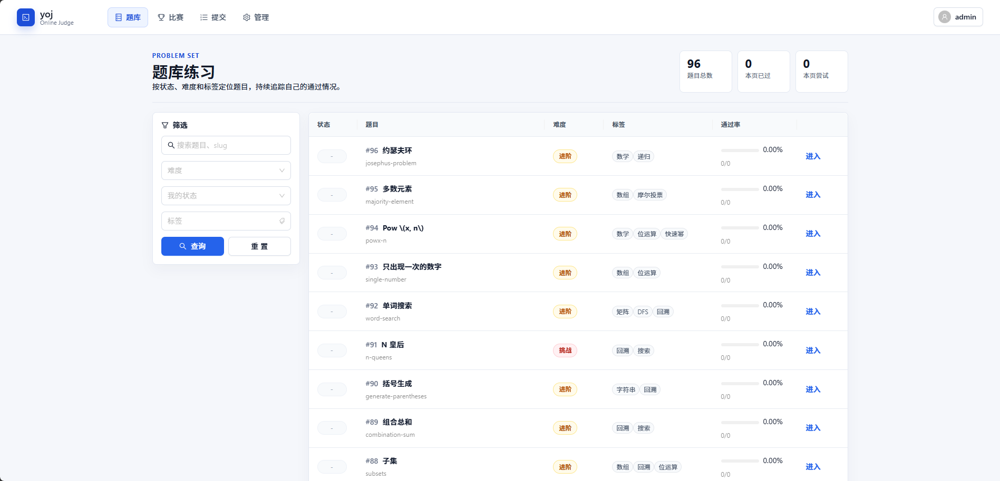

# yoj

yoj 是一个本地学习用的 Code Online Judge。当前版本实现题库练习、用户注册登录、题目管理、测试点管理、代码提交和 Redis 异步判题。

## 技术栈

- 后端：Go、Gin、GORM、MySQL、Redis、JWT
- 前端：React、TypeScript、Vite、Ant Design、Monaco Editor
- 判题：本地 Docker Worker

## 图示



## 本地依赖

- MySQL：默认 `root/root`，数据库名 `yoj`
- Redis：默认 `127.0.0.1:6379`，无密码
- Docker：用于运行 Go、C、C++、Python 判题容器
- Node.js 与 npm
- Go

如果本机没有 MySQL 或 Redis，可以使用：

```powershell
docker compose up -d mysql redis
```

## 启动后端 API

```powershell
cd server
$env:GOCACHE="D:\code\go\yoj\.cache\go-build"
$env:GOPATH="D:\code\go\yoj\.gopath"
go run ./cmd/api
```

API 默认监听 `http://localhost:8080`。

首次启动会自动创建数据库表、管理员账号和一道示例题。

默认管理员：

- 用户名：`admin`
- 密码：`admin123`

## 启动判题 Worker

另开一个终端：

```powershell
cd server
$env:GOCACHE="D:\code\go\yoj\.cache\go-build"
$env:GOPATH="D:\code\go\yoj\.gopath"
go run ./cmd/worker
```

Worker 会消费 Redis 队列中的提交任务。默认 `YOJ_JUDGE_MODE=host`，会使用本机的 `go`、`gcc`、`g++`、`python` 执行代码，适合 localhost 学习环境。

如果要改回 Docker 沙箱模式：

```powershell
$env:YOJ_JUDGE_MODE="docker"
go run ./cmd/worker
```

Docker 模式第一次判题时可能需要拉取这些镜像：

- `golang:1.22`
- `gcc:13`
- `python:3.12-alpine`

## 启动前端

```powershell
cd web
npm install
npm run dev
```

前端默认访问 `http://localhost:5173`。

## 环境变量

后端默认配置见 [server/.env.example](server/.env.example)。当前实现直接读取系统环境变量；本地默认值已经匹配：

- MySQL：`root/root`
- Redis：空密码
- CORS：允许 `localhost:5173`

## 当前功能

- 用户注册、登录、退出
- 普通用户浏览题库、查看题面、提交代码、查看提交记录
- 登录用户可查看全站提交记录，但提交代码仅提交者本人可见
- 管理员创建、编辑、删除题目
- 管理员创建、编辑、删除测试点
- 管理员维护标签，并通过题目编辑关联标签
- 管理员查看并筛选全站提交记录
- 管理员可对提交进行重判
- 管理员查看用户列表、按用户名/角色筛选、调整用户角色
- 管理后台概览用户、题目、提交、判题队列等状态
- 比赛系统基础版：比赛列表、报名、比赛内提交、实时榜单
- 管理员创建、编辑、删除比赛，并配置比赛题目顺序和分值
- 支持 Go、C、C++、Python
- 判题状态：Pending、Judging、Accepted、Wrong Answer、Compile Error、Runtime Error、Time Limit Exceeded、Memory Limit Exceeded、System Error

## 注意

当前默认的 host 判题模式会直接在本机执行提交代码，只适合本地学习和可信代码。Docker 模式也只是本地学习版沙箱，不是生产级安全隔离方案。后续如果要公网部署，需要单独强化容器权限、系统调用限制、网络与文件系统隔离、任务超时清理和 Worker 调度。
